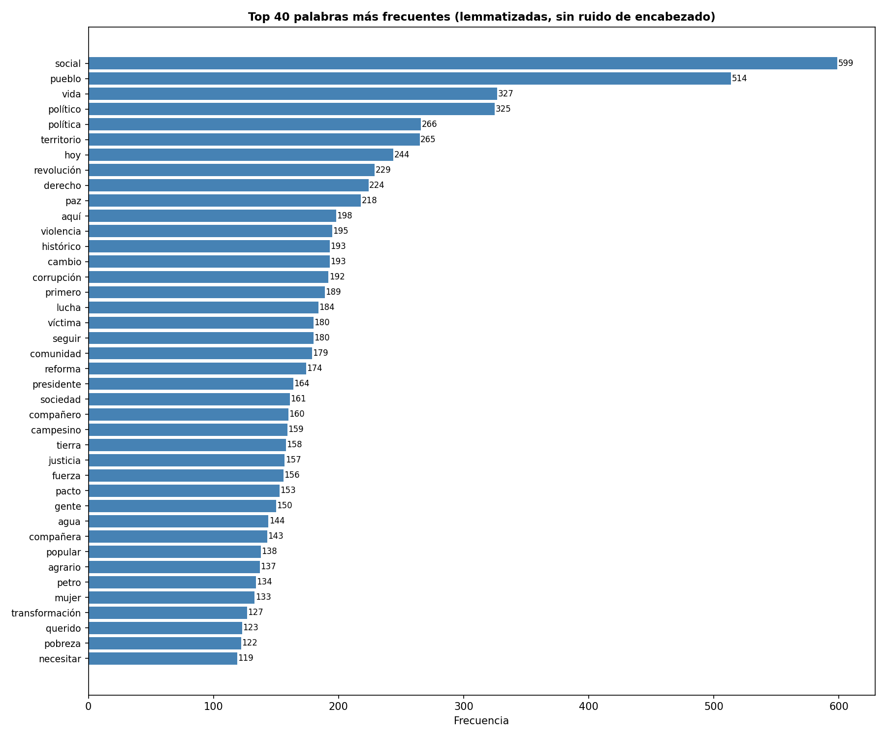
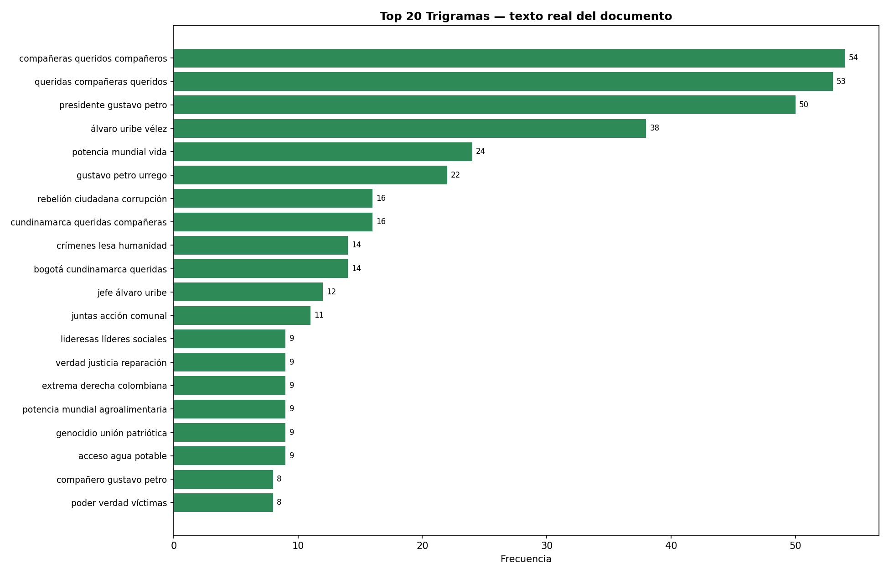
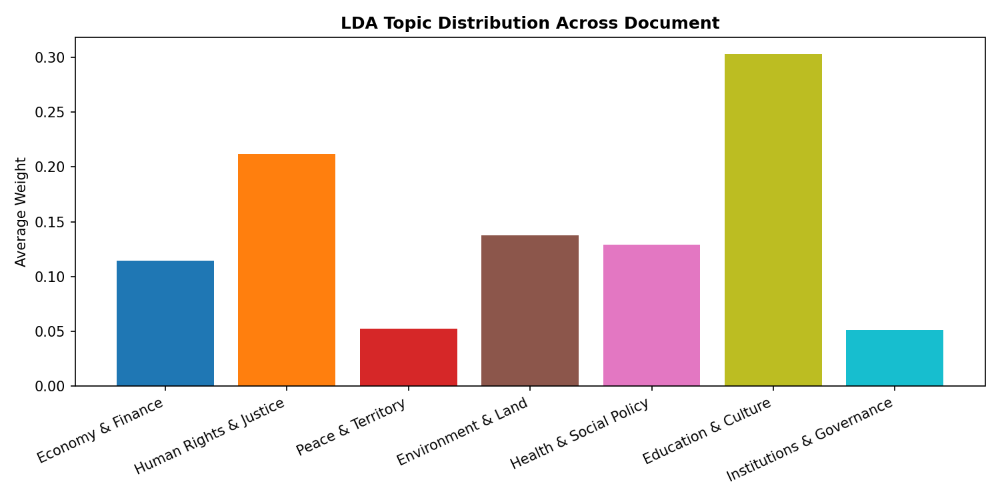
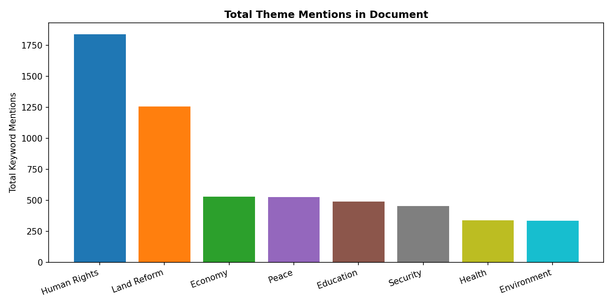
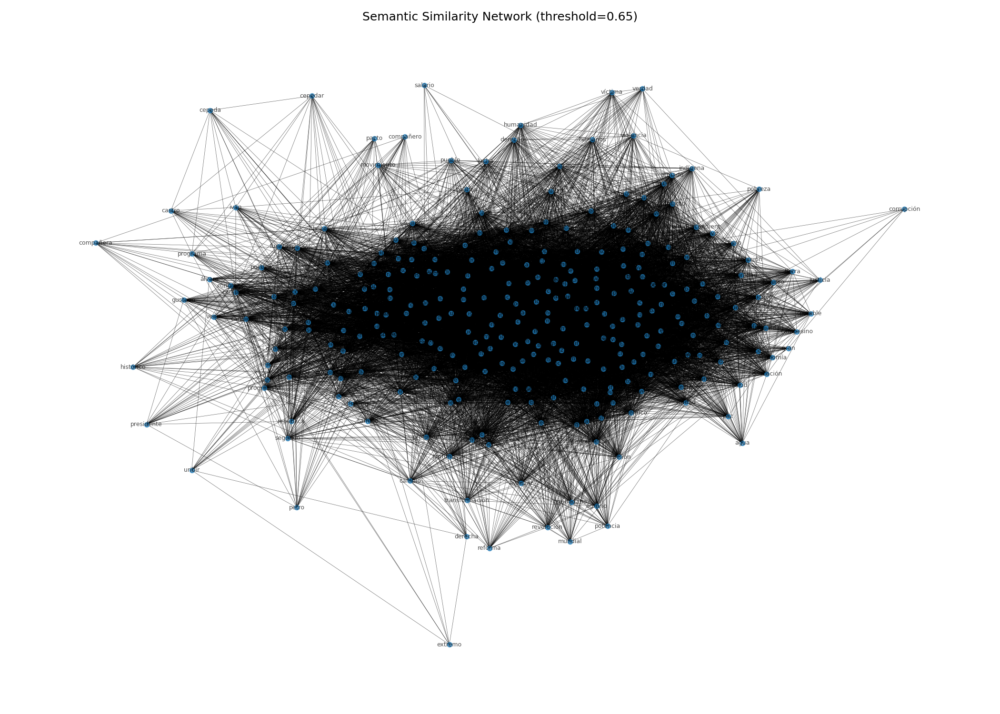
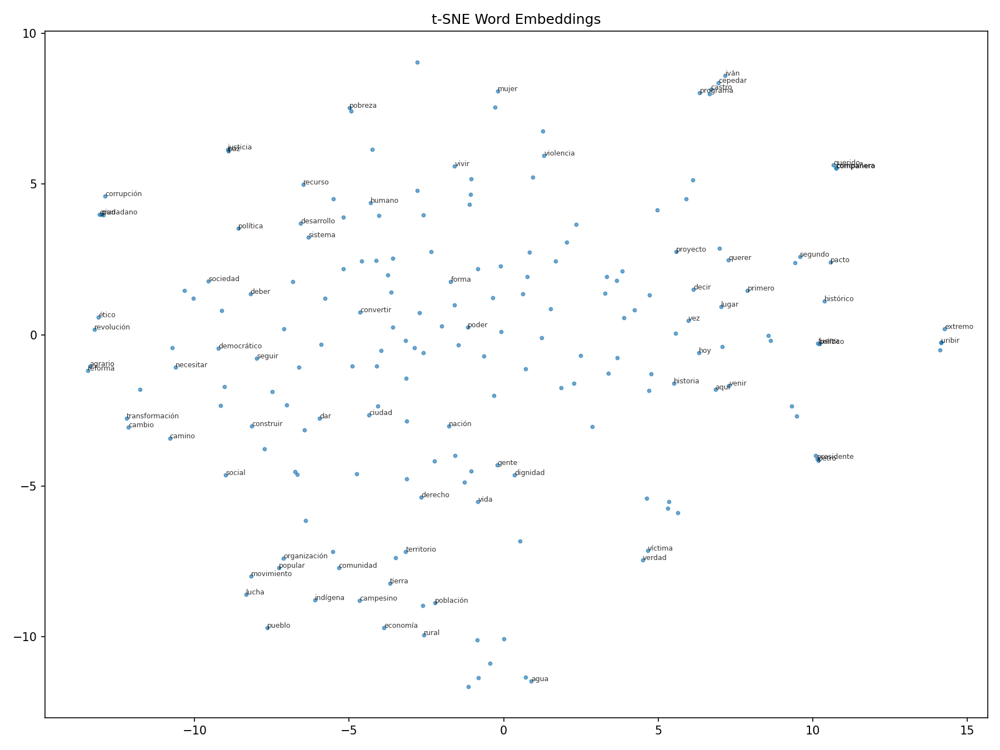
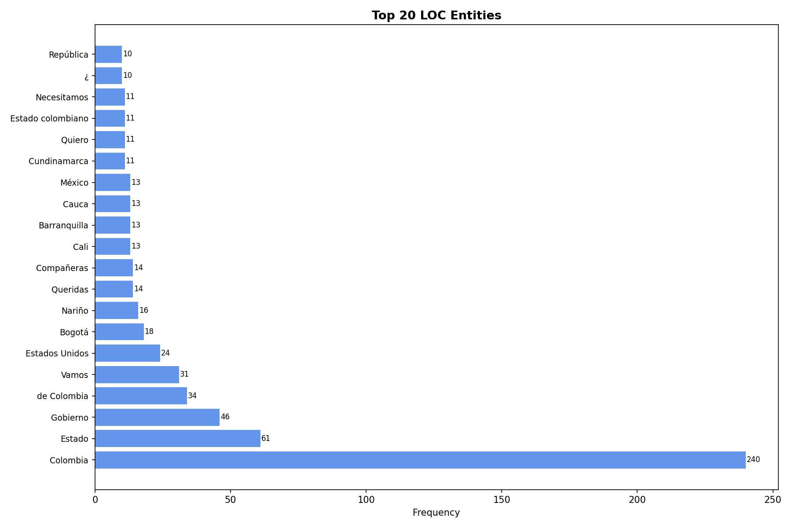
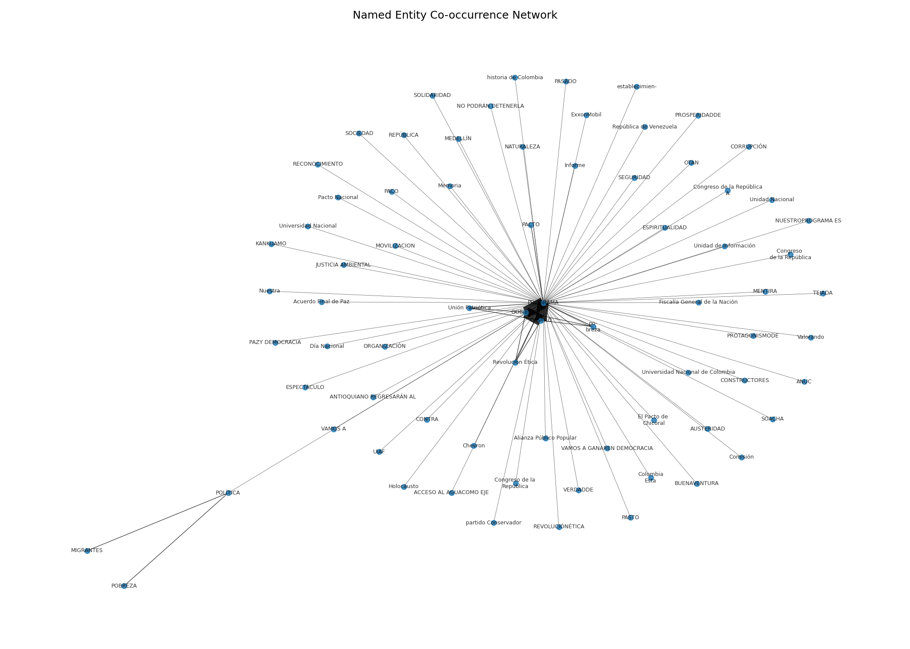
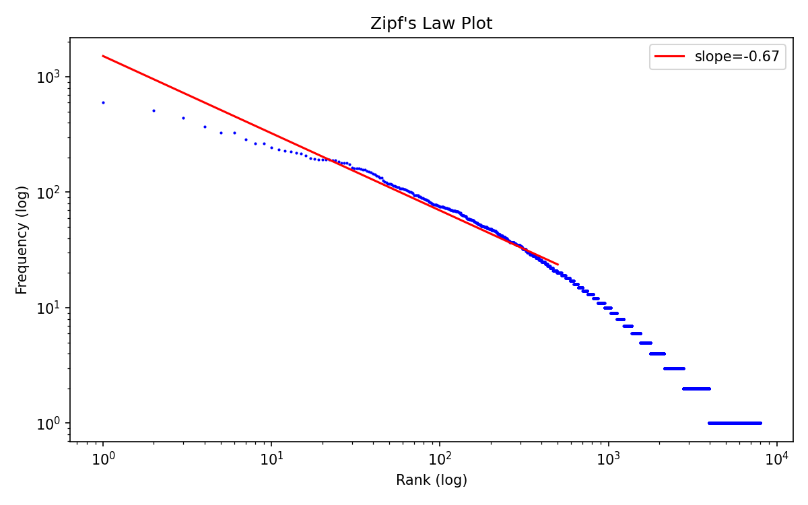

# Análisis Computacional del Programa de Gobierno de Iván Cepeda Castro
### Elecciones Presidenciales Colombia 2026–2030

> **Economía Política · Procesamiento de Lenguaje Natural · Análisis de Discurso**  
> David Muñoz — 2026

---

## ¿Por qué este análisis?

Los programas de gobierno son documentos políticos densos que rara vez se leen en su totalidad. Este proyecto aplica herramientas de economía política y procesamiento de lenguaje natural (NLP) para diseccionar de forma sistemática el programa de Iván Cepeda Castro, candidato de izquierda a la presidencia de Colombia 2026–2030.

La pregunta central no es si el programa es bueno o malo, sino **qué dice realmente, cómo lo dice, y qué prioridades revela su lenguaje**. En economía política, el análisis del discurso no es accesorio: los marcos conceptuales que usan los candidatos condicionan después las políticas que implementan. Un candidato que habla de "redistribución" más que de "crecimiento" tiene un modelo mental diferente, y eso tiene consecuencias reales sobre la asignación de recursos públicos.

---

## Estructura del análisis

| Sección | Método | Pregunta que responde |
|---|---|---|
| 1. Extracción y limpieza | PyMuPDF, spaCy, NLTK | ¿Cuál es el corpus real del documento? |
| 2. Análisis de frecuencias | N-gramas, Word Cloud, Zipf | ¿Qué conceptos dominan el discurso? |
| 3. Modelado de tópicos | LDA + NMF (7 tópicos) | ¿Cuáles son los ejes temáticos del programa? |
| 4. Análisis de sentimiento | BERT en español (robertuito) | ¿El tono es propositivo o confrontacional? |
| 5. Análisis semántico | Word2Vec, redes de similitud | ¿Cómo se relacionan conceptualmente los temas? |
| 6. Análisis retórico | NER, densidad, legibilidad | ¿A quién nombra, cómo escribe, qué tan complejo es? |
| 7. Inmersión temática | Diccionarios por eje de política | ¿Cuánto espacio le dedica a cada eje económico-social? |

---

## Principales hallazgos

### El programa es, ante todo, un documento sobre redistribución

La nube de palabras y el análisis de frecuencias revelan que los términos más frecuentes no son institucionales ni tecnocráticos. Palabras como **"pueblo", "territorio", "social", "poder", "vida", "paz"** dominan el vocabulario limpio. Esto contrasta con programas de gobierno de centroderecha, donde predominan términos como "inversión", "empresa", "crecimiento", "competitividad". El marco conceptual es claramente redistributivo y de economía política heterodoxa.

### Wordcloud — Vocabulario dominante del programa


---

### Las 40 palabras más frecuentes (lemmatizadas)

El análisis de unigrams confirma que el discurso orbita alrededor de conceptos de justicia social, territorialidad y construcción de paz — no alrededor de variables macroeconómicas convencionales como inflación, déficit o productividad.



---

### Bigramas y trigramas — Las unidades de sentido reales

Los n-gramas revelan los conceptos compuestos que articulan el programa. En economía política, importa más "reforma agraria" que "reforma" sola, o "deuda externa" que "deuda". Los bigramas y trigramas muestran los marcos de política públicamente comprometidos.




---

### Distribución de tópicos — Los 7 ejes del programa (LDA)

El modelo LDA identifica 7 grandes ejes temáticos latentes en el texto. Lo notable desde una perspectiva de economía política es la **ausencia relativa de un tópico puramente macroeconómico**: los temas de instituciones, guerra, derechos humanos y territorio dominan sobre los de política fiscal o monetaria.



---

### ¿Dónde concentra su atención el documento? (Heatmap temático)

Este mapa de calor muestra la intensidad de mención de cada eje de política pública a lo largo del documento, dividido en bloques de 10 páginas. Permite identificar si el programa trata los temas de forma integrada o si los agrupa por capítulos.


---

### Evolución temática a lo largo del documento

La línea temporal de menciones temáticas revela la arquitectura narrativa del programa: qué temas abre la discusión, cuáles aparecen de forma transversal y cuáles se concentran hacia el final.


---

### Peso relativo de cada eje de política

Desde una perspectiva de economía política, la distribución de menciones es en sí misma una declaración de prioridades. Un programa que menciona "derechos humanos" el doble que "economía" está revelando su jerarquía de valores — lo cual no es necesariamente bueno o malo, pero sí informativo.



---

### Análisis de sentimiento — ¿Propositivo o confrontacional?

Usando el modelo BERT entrenado en español (robertuito), se analizó el tono página por página. La **curva de sentimiento** muestra que el documento oscila entre pasajes de sentimiento positivo-propositivo (cuando habla de reformas y propuestas) y negativos (cuando diagnostica la situación actual del país).

Este patrón es típico de los programas de izquierda latinoamericana: diagnóstico crítico + propuesta transformadora. La pregunta económica relevante es si las propuestas son fiscalmente viables dado ese diagnóstico.


---

### Red semántica — ¿Cómo se conectan los conceptos?

La red de similitud semántica (Word2Vec, umbral coseno > 0.65) muestra qué palabras el modelo considera conceptualmente equivalentes o asociadas dentro del corpus del programa. Las redes densas indican coherencia ideológica; las redes fragmentadas indicarían un programa más ecléctico.



---

### Embeddings de palabras (t-SNE)

La proyección t-SNE de los embeddings Word2Vec permite visualizar clústeres conceptuales en el espacio semántico del documento. Cada punto es una palabra; la proximidad refleja similitud contextual dentro del programa — no similitud semántica universal.



---

### ¿A quién nombra el programa? (NER — Entidades nombradas)

El análisis de reconocimiento de entidades nombradas (NER) revela los actores que el programa referencia explícitamente. En economía política institucional, **el conjunto de actores mencionados define el espacio de coaliciones que el candidato imagina** para su programa de gobierno.






---

### Análisis retórico — ¿Cómo escribe?

| Indicador | Valor |
|---|---|
| Longitud promedio de oración | Ver `readability.txt` |
| Longitud promedio de palabra | Ver `readability.txt` |
| Índice de legibilidad Flesch (adaptado ES) | Ver `readability.txt` |
| Type-Token Ratio (TTR) | 0.1475 |
| MTLD (riqueza léxica) | 366.73 |

Un TTR de 0.15 en un documento de 433 páginas indica vocabulario repetitivo — esperable en un programa de gobierno donde ciertos conceptos deben reiterarse para construir coherencia ideológica. Un MTLD de 366 es sólido para un texto político formal.


---

### Ley de Zipf — ¿Es un texto natural?

La ley de Zipf establece que en cualquier corpus lingüístico natural, la frecuencia de una palabra es inversamente proporcional a su rango. La pendiente observada confirma que el programa sigue distribución de lenguaje natural — no es un texto generado artificialmente ni es una repetición mecánica de consignas.



---

## Sobre la metodología

Este análisis usa exclusivamente texto limpio y lematizado — sin nombres propios, números, URLs ni stopwords en español. El modelo de lenguaje es `es_core_news_sm` de spaCy para lematización y NER, y `robertuito-base-uncased-sentiment` de pysentimiento para análisis de sentimiento, ambos modelos entrenados en corpus de español latinoamericano.

El análisis **no toma posición política**. Los hallazgos son descriptivos: qué dice el documento, con qué énfasis, y en qué tono. La evaluación normativa — si las propuestas son deseables o viables — queda fuera del alcance de este repositorio.

---

## Reproducibilidad

```bash
git clone https://github.com/DavidMume/analisis-plan-gobierno-ivan-cepeda-2026.git
cd analisis-plan-gobierno-ivan-cepeda-2026

pip install pymupdf nltk spacy scikit-learn gensim wordcloud matplotlib \
            seaborn networkx pyLDAvis umap-learn pysentimiento lexicalrichness

python -m spacy download es_core_news_sm

# Colocar el PDF en la ruta indicada en analyze.py y ejecutar:
python analyze.py
```

---

## Archivos generados

| Archivo | Descripción |
|---|---|
| `wordcloud.png` | Nube de palabras del corpus limpio |
| `top40_unigrams.png` | Frecuencia de las 40 palabras más comunes |
| `top25_bigrams.png` | Top 25 bigramas |
| `top20_trigrams.png` | Top 20 trigramas |
| `top10_quadgrams.png` | Top 10 cuadrigramas |
| `zipf_law.png` | Verificación ley de Zipf |
| `lda_topic_distribution.png` | Distribución de tópicos LDA |
| `lda_interactive.html` | Visualización interactiva LDA (pyLDAvis) |
| `sentiment_arc.png` | Arco de sentimiento página por página |
| `sentiment_distribution.png` | Distribución global de sentimiento |
| `top_paragraphs.txt` | Los 5 párrafos más positivos y negativos |
| `semantic_network.png` | Red de similitud semántica Word2Vec |
| `tsne_embeddings.png` | Proyección t-SNE de word embeddings |
| `word2vec_similarities.txt` | Palabras más similares a términos clave |
| `kwic.txt` | Keyword-in-Context para términos clave |
| `readability.txt` | Métricas de legibilidad |
| `sentence_length_hist.png` | Distribución de longitud de oraciones |
| `sentence_starters.png` | Iniciadores de oración más frecuentes |
| `density_heatmap.png` | Densidad de palabras por página |
| `ner_org.png` | Top organizaciones mencionadas (NER) |
| `ner_loc.png` | Top lugares mencionados (NER) |
| `ner_cooccurrence_network.png` | Red de co-ocurrencia de entidades |
| `theme_counts_per_page.csv` | Menciones temáticas por página (datos crudos) |
| `theme_mentions_timeline.png` | Evolución temática a lo largo del documento |
| `theme_heatmap.png` | Heatmap de intensidad temática por sección |
| `theme_totals.png` | Peso total de cada eje temático |
| `analyze.py` | Script completo reproducible |

---

*David Muñoz · 2026 · Colombia*
