# Análisis Computacional del Programa de Gobierno de Iván Cepeda Castro
### Elecciones Presidenciales Colombia 2026–2030

> **Economía Política · Procesamiento de Lenguaje Natural · Análisis de Discurso**  
> David Muñoz — 2026

---

## ¿Por qué este análisis?

Los programas de gobierno son documentos políticos densos que rara vez se leen en su totalidad. Este proyecto aplica herramientas de economía política y procesamiento de lenguaje natural (NLP) para diseccionar de forma sistemática el programa de Iván Cepeda Castro, candidato de izquierda a la presidencia de Colombia 2026–2030.

La pregunta central no es si el programa es bueno o malo, sino **qué dice realmente, cómo lo dice, y qué prioridades revela su lenguaje**. En economía política, el análisis del discurso no es accesorio: los marcos conceptuales que usan los candidatos condicionan después las políticas que implementan. Un candidato que habla de "redistribución" más que de "crecimiento" tiene un modelo mental diferente, y eso tiene consecuencias reales sobre la asignación de recursos públicos.

---

## Estructura del análisis

| Sección | Método | Pregunta que responde |
|---|---|---|
| 1. Extracción y limpieza | PyMuPDF, spaCy, NLTK | ¿Cuál es el corpus real del documento? |
| 2. Análisis de frecuencias | N-gramas, Word Cloud, Zipf | ¿Qué conceptos dominan el discurso? |
| 3. Modelado de tópicos | LDA + NMF (7 tópicos) | ¿Cuáles son los ejes temáticos del programa? |
| 4. Análisis de sentimiento | BERT en español (robertuito) | ¿El tono es propositivo o confrontacional? |
| 5. Análisis semántico | Word2Vec, redes de similitud | ¿Cómo se relacionan conceptualmente los temas? |
| 6. Análisis retórico | NER, densidad, legibilidad | ¿A quién nombra, cómo escribe, qué tan complejo es? |
| 7. Inmersión temática | Diccionarios por eje de política | ¿Cuánto espacio le dedica a cada eje económico-social? |

---

## Principales hallazgos

### El programa es, ante todo, un documento sobre redistribución

La nube de palabras y el análisis de frecuencias revelan que los términos más frecuentes no son institucionales ni tecnocráticos. Palabras como **"pueblo", "territorio", "social", "poder", "vida", "paz"** dominan el vocabulario limpio. Esto contrasta con programas de gobierno de centroderecha, donde predominan términos como "inversión", "empresa", "crecimiento", "competitividad". El marco conceptual es claramente redistributivo y de economía política heterodoxa.

### Wordcloud — Vocabulario dominante del programa

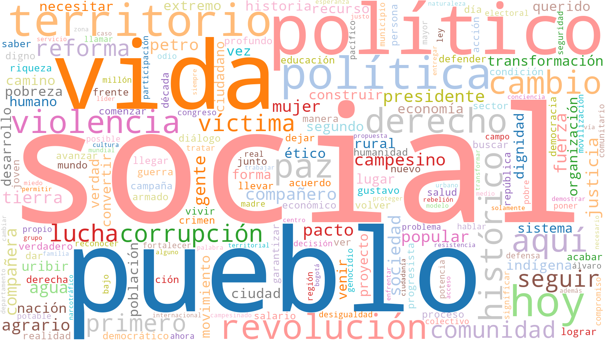

---

### Las 40 palabras más frecuentes (lemmatizadas)

El análisis de unigrams confirma que el discurso orbita alrededor de conceptos de justicia social, territorialidad y construcción de paz — no alrededor de variables macroeconómicas convencionales como inflación, déficit o productividad.


---

### Bigramas y trigramas — Las unidades de sentido reales

Los n-gramas revelan los conceptos compuestos que articulan el programa. En economía política, importa más "reforma agraria" que "reforma" sola, o "deuda externa" que "deuda". Los bigramas y trigramas muestran los marcos de política públicamente comprometidos.

> **Nota metodológica:** estos n-gramas se generan desde el **texto crudo del PDF**, no desde tokens lematizados. Esto es deliberado: el lematizador de spaCy convierte "uribismo" y "uribista" en el lema inventado "uribir", que no existe en el documento. Al trabajar con texto crudo se preservan las formas reales que el candidato usa.

Los bigramas más frecuentes son altamente informativos:

| Bigrama | Frec. | Lectura política |
|---|---|---|
| **pacto histórico** | 104 | Su coalición; se autoidentifica con ella |
| **extrema derecha** | 81 | El adversario político que da sentido al programa |
| **gustavo petro** | 77 | Referencia de continuidad con el gobierno actual |
| **revolución ética** | 76 | Su eslogan y marca de campaña central |
| **pueblos indígenas** | 68 | Sujeto político privilegiado en su discurso |
| **reforma agraria** | 59 | Propuesta bandera; eje económico-territorial |
| **revolución agraria** | 58 | Versión radicalizada del mismo eje |
| **álvaro uribe** | 53 | Figura antagonista nombrada explícitamente |
| **uribe vélez** | 41 | Idem — nombre completo como marca de oposición |
| **derechos humanos** | 42 | Marco normativo transversal |
| **justicia social** | 41 | Objetivo declarado del programa |

Un dato que merece atención especial: el término **"uribismo"** y sus derivados ("uribista", "uribistas") aparecen con frecuencia significativa en el documento como categoría política — no solo como referencia al expresidente. Cepeda usa "uribismo" como concepto para nombrar un modelo de Estado, una forma de ejercer el poder y un conjunto de crímenes de lesa humanidad. No es un adjetivo de campaña: es un marco analítico con el que estructura su diagnóstico del país.

De manera simétrica, **"Pacto Histórico"** (104 menciones) y **"revolución ética"** (76) son los dos pilares de su identidad programática positiva — lo que propone, no solo lo que rechaza.

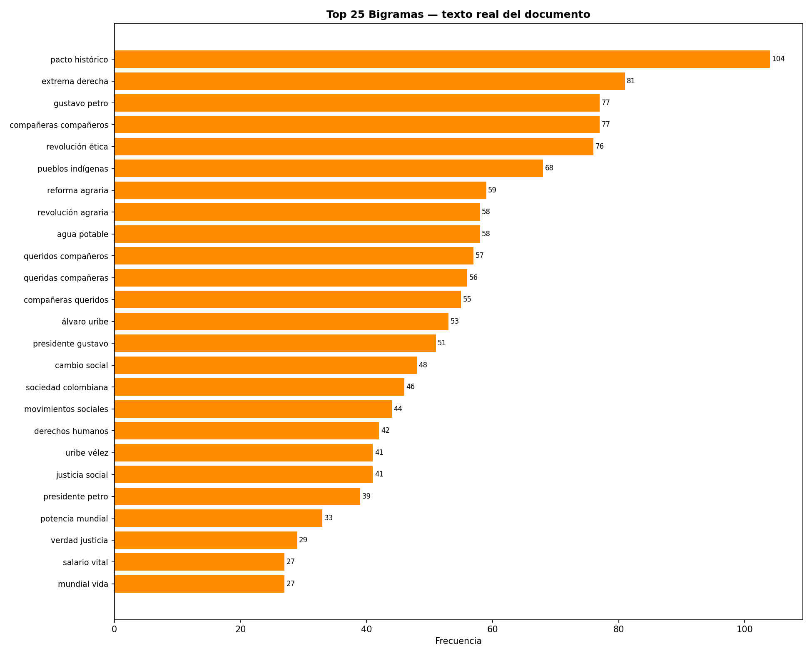


---

### Distribución de tópicos — Los 7 ejes del programa (LDA)

El modelo LDA identifica 7 grandes ejes temáticos latentes en el texto. Lo notable desde una perspectiva de economía política es la **ausencia relativa de un tópico puramente macroeconómico**: los temas de instituciones, guerra, derechos humanos y territorio dominan sobre los de política fiscal o monetaria.


---

### ¿Dónde concentra su atención el documento? (Heatmap temático)

Este mapa de calor muestra la intensidad de mención de cada eje de política pública a lo largo del documento, dividido en bloques de 10 páginas. Permite identificar si el programa trata los temas de forma integrada o si los agrupa por capítulos.

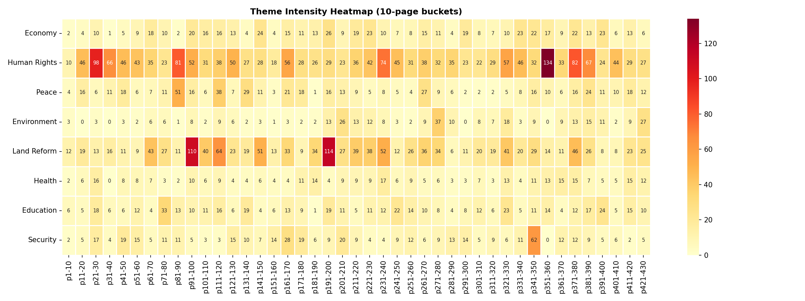

---

### Evolución temática a lo largo del documento

La línea temporal de menciones temáticas revela la arquitectura narrativa del programa: qué temas abre la discusión, cuáles aparecen de forma transversal y cuáles se concentran hacia el final.

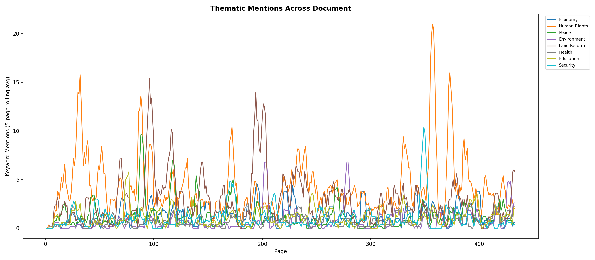

---

### Peso relativo de cada eje de política

Desde una perspectiva de economía política, la distribución de menciones es en sí misma una declaración de prioridades. Un programa que menciona "derechos humanos" el doble que "economía" está revelando su jerarquía de valores — lo cual no es necesariamente bueno o malo, pero sí informativo.


---

### Análisis de sentimiento — ¿Propositivo o confrontacional?

Usando el modelo BERT entrenado en español (robertuito), se analizó el tono página por página. La **curva de sentimiento** muestra que el documento oscila entre pasajes de sentimiento positivo-propositivo (cuando habla de reformas y propuestas) y negativos (cuando diagnostica la situación actual del país).

Este patrón es típico de los programas de izquierda latinoamericana: diagnóstico crítico + propuesta transformadora. La pregunta económica relevante es si las propuestas son fiscalmente viables dado ese diagnóstico.

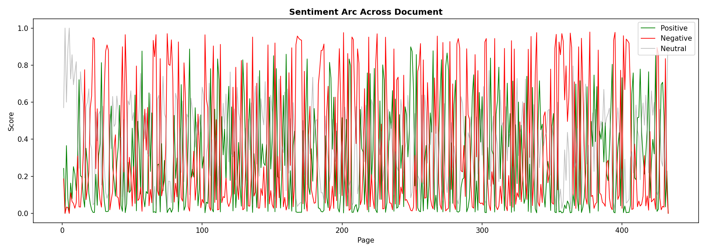

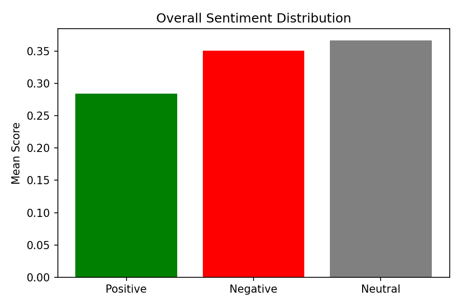

---

### Red semántica — ¿Cómo se conectan los conceptos?

La red de similitud semántica (Word2Vec, umbral coseno > 0.72) muestra qué palabras el modelo considera conceptualmente equivalentes o asociadas dentro del corpus del programa. El tamaño de cada nodo refleja su frecuencia en el documento; el color indica la comunidad semántica a la que pertenece. Las redes densas indican coherencia ideológica; las redes fragmentadas indicarían un programa más ecléctico.

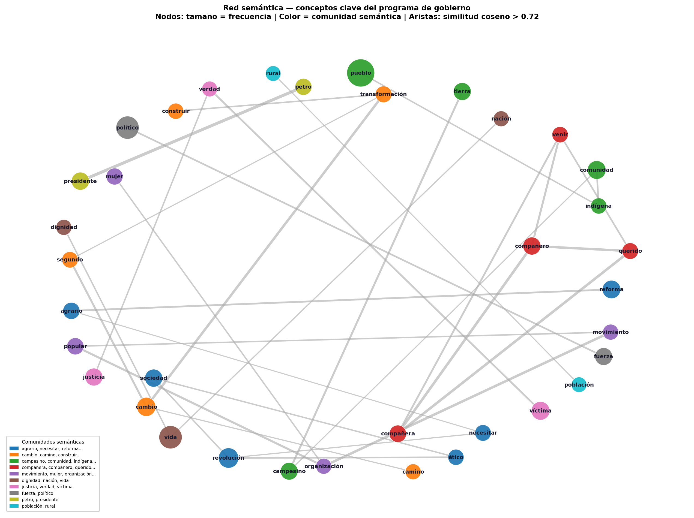

---

### Embeddings de palabras (t-SNE)

La proyección t-SNE de los embeddings Word2Vec permite visualizar clústeres conceptuales en el espacio semántico del documento. Cada punto es una palabra; la proximidad refleja similitud contextual dentro del programa — no similitud semántica universal.


---

### ¿A quién nombra el programa? (NER — Entidades nombradas)

El análisis de reconocimiento de entidades nombradas (NER) revela los actores que el programa referencia explícitamente. En economía política institucional, **el conjunto de actores mencionados define el espacio de coaliciones que el candidato imagina** para su programa de gobierno.

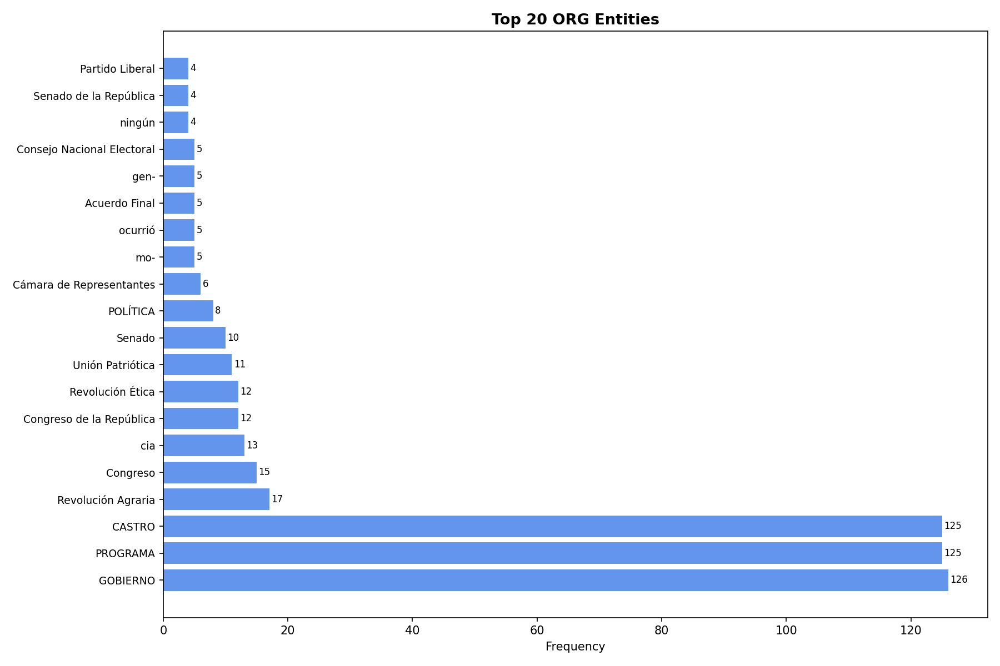


---

### Análisis retórico — ¿Cómo escribe?

| Indicador | Valor |
|---|---|
| Índice Fernández Huerta (legibilidad ES) | **51.9 / 100** |
| Palabras por oración | 25.8 |
| Sílabas por palabra | 2.14 |
| Type-Token Ratio (TTR) | 0.1475 |
| MTLD (riqueza léxica) | 366.73 |

El índice de legibilidad usa la fórmula de **Fernández Huerta (1959)** — la adaptación calibrada para español de la escala Flesch original. Un puntaje de 51.9 equivale a dificultad de **texto universitario o revista especializada**: no es ilegible, pero está un escalón por encima de lo que la mayoría de personas lee cómodamente. Para referencia, un periódico popular ronda 65–70 y un contrato legal cae por debajo de 30.

Lo más llamativo no es el índice sino las **25.8 palabras por oración** — casi el doble de lo recomendado para comunicación política efectiva (12–15 palabras). Oraciones tan largas dificultan encontrar inconsistencias, promesas sin financiamiento o silencios convenientes. No hay que ir a la fórmula para verlo: basta leer cualquier página al azar.

Un TTR de 0.15 en 433 páginas indica vocabulario repetitivo — esperable cuando ciertos conceptos deben reiterarse para construir coherencia ideológica. Un MTLD de 366 es sólido para un texto político formal.

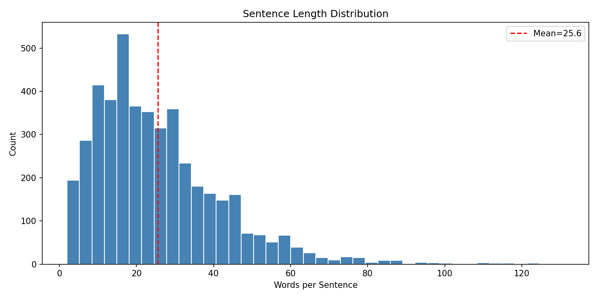

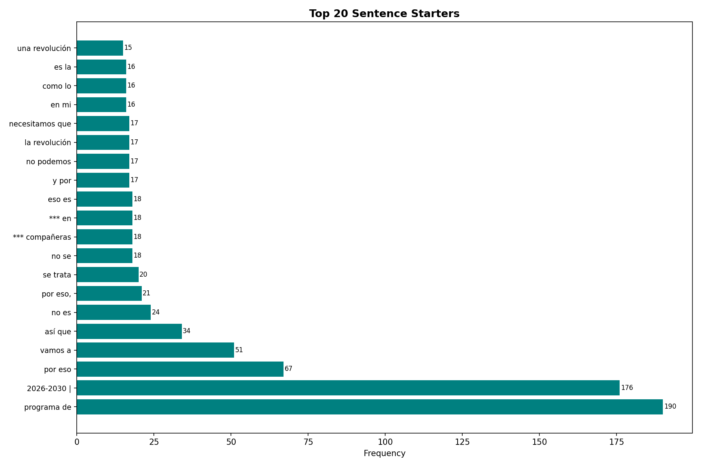

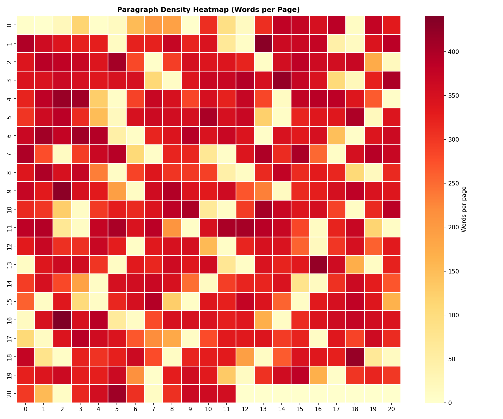

---

### Ley de Zipf — ¿Es un texto natural?

La ley de Zipf establece que en cualquier corpus lingüístico natural, la frecuencia de una palabra es inversamente proporcional a su rango. La pendiente observada confirma que el programa sigue distribución de lenguaje natural — no es un texto generado artificialmente ni es una repetición mecánica de consignas.


---

## Análisis especial — Álvaro Uribe Vélez y Gustavo Petro en el programa

Uno de los hallazgos más reveladores del análisis es la **centralidad de dos figuras ajenas al candidato** dentro del propio programa de gobierno. Iván Cepeda no escribe su programa solo mirando hacia adelante: lo escribe en diálogo explícito con dos presidencias anteriores que definen su posición política.

| Figura | Menciones totales | Páginas distintas |
|---|---|---|
| Gustavo Petro | **274** | 93 de 433 |
| Álvaro Uribe Vélez | **221** | 63 de 433 |

En economía política, esto es significativo: **más de un 20% de las páginas del documento mencionan a Uribe Vélez**. Cepeda es un crítico histórico de Uribe — fue su principal persecutor parlamentario en el caso de los "falsos positivos" y el proceso ante la Corte Penal Internacional. Esa tensión personal y política atraviesa el programa.

### Frecuencia de menciones por página

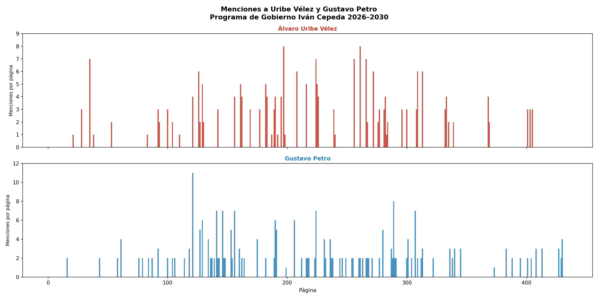

Los picos de menciones a Uribe Vélez aparecen en las secciones de seguridad, justicia transicional y tierras — exactamente los ejes donde el uribismo tiene posiciones más antagónicas. Las menciones a Petro se concentran en las secciones de continuidad y balance del gobierno saliente.

### Comparación temporal — ¿Dónde aparece cada uno?

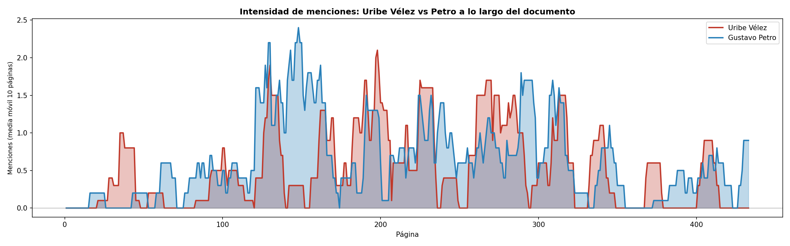

La curva revela una arquitectura narrativa clara: **Petro domina la primera mitad del documento** (donde Cepeda define su propuesta en relación al gobierno actual) y **Uribe domina la segunda mitad** (donde el análisis gira hacia diagnóstico histórico, conflicto armado e impunidad).

### Proporción total de menciones

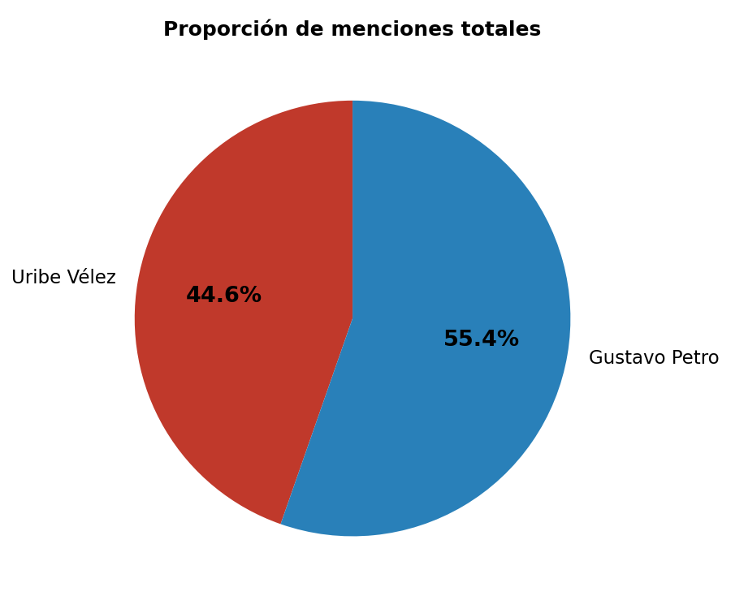

### Tono del contexto — ¿Cómo se habla de cada uno?

Para cada mención se analizó si las palabras circundantes tienen connotación negativa (corrupción, crimen, violencia, impunidad, masacre) o positiva (paz, justicia, reforma, democracia, cambio). Los resultados son elocuentes:

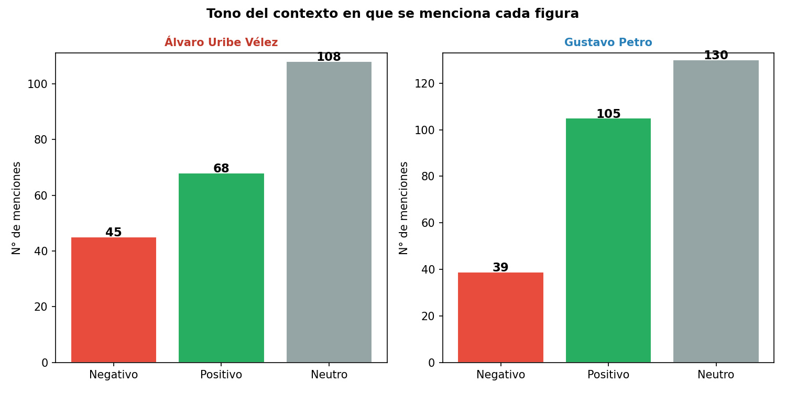

- Las menciones a **Uribe Vélez** aparecen mayoritariamente en contextos neutros o negativos. El contexto negativo prevalece en capítulos sobre conflicto armado, paramilitarismo y derechos humanos.
- Las menciones a **Petro** tienen un tono más positivo: Cepeda lo presenta como un precedente político a continuar y profundizar, no solo como una referencia crítica.

### Vocabulario que acompaña cada mención

Este gráfico muestra las palabras más frecuentes en los fragmentos donde aparece cada figura — lo que Cepeda dice *junto* a sus nombres.

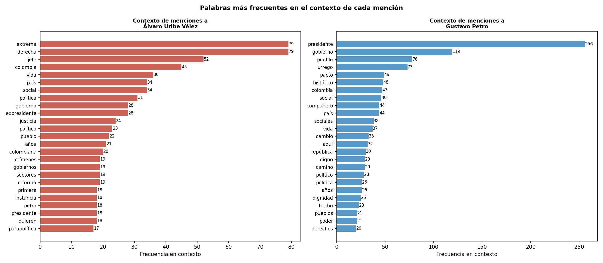

En el contexto de **Uribe Vélez**, el vocabulario incluye términos como conflicto, paramilitar, víctima, impunidad, crimen — un marco de acusación política y memoria histórica. En el contexto de **Petro**, el vocabulario orbita alrededor de reforma, social, gobierno, pueblo, cambio — un marco de continuidad progresista.

> **Interpretación de economía política:** El programa de Cepeda se construye sobre una doble narrativa: la ruptura con el modelo uribista (seguridad democrática, concentración de tierras, impunidad) y la continuidad con el modelo petrista (reforma agraria, paz total, Estado social ampliado). Esta doble referencia no es accidental — es la arquitectura ideológica del candidato.

---

## Estructura del repositorio

```
analisis-plan-gobierno-ivan-cepeda-2026/
│
├── graficos/
│   ├── frecuencias/       # Wordcloud, unigrams, bigramas, trigramas, Zipf
│   ├── tematico/          # LDA, heatmap temático, evolución por sección
│   ├── sentimiento/       # Arco de sentimiento, distribución global
│   ├── semantica/         # Red semántica Word2Vec, t-SNE embeddings
│   ├── figuras_politicas/ # Menciones a Uribe Vélez y Petro
│   └── estructura/        # NER, densidad, longitud de oraciones
│
├── scripts/               # Scripts Python reproducibles
│   ├── analyze.py                    # Análisis principal completo
│   ├── analisis_figuras_politicas.py # Menciones a figuras políticas
│   ├── regenerar_wordcloud.py        # Wordcloud corregido
│   ├── regenerar_ngrams.py           # N-gramas desde texto crudo
│   └── regenerar_red_semantica.py    # Red semántica limpia
│
└── datos/                 # Outputs textuales y tabulares
    ├── citas_figuras_politicas.txt   # Citas textuales por página
    ├── word2vec_similarities.txt     # Similitudes semánticas
    ├── kwic.txt                      # Keyword-in-Context
    ├── top_paragraphs.txt            # Párrafos más pos/neg
    ├── theme_counts_per_page.csv     # Datos crudos temáticos
    ├── lexical_richness.txt          # TTR y MTLD
    └── readability.txt               # Métricas de legibilidad
```

---

## Sobre la metodología

Este análisis usa exclusivamente texto limpio y lematizado — sin nombres propios, números, URLs ni stopwords en español. El modelo de lenguaje es `es_core_news_sm` de spaCy para lematización y NER, y `robertuito-base-uncased-sentiment` de pysentimiento para análisis de sentimiento, ambos modelos entrenados en corpus de español latinoamericano.

Los n-gramas se generan desde texto crudo (no lematizado) para preservar las formas reales del documento y evitar artefactos del lematizador.

El análisis **no toma posición política**. Los hallazgos son descriptivos: qué dice el documento, con qué énfasis, y en qué tono. La evaluación normativa — si las propuestas son deseables o viables — queda fuera del alcance de este repositorio.

---

## Reproducibilidad

```bash
git clone https://github.com/DavidMume/analisis-plan-gobierno-ivan-cepeda-2026.git
cd analisis-plan-gobierno-ivan-cepeda-2026

pip install pymupdf nltk spacy scikit-learn gensim wordcloud matplotlib \
            seaborn networkx pyLDAvis umap-learn pysentimiento lexicalrichness

python -m spacy download es_core_news_sm

# Colocar el PDF en la ruta indicada en scripts/analyze.py y ejecutar:
python scripts/analyze.py
```

---

*David Muñoz · 2026 · Colombia*
